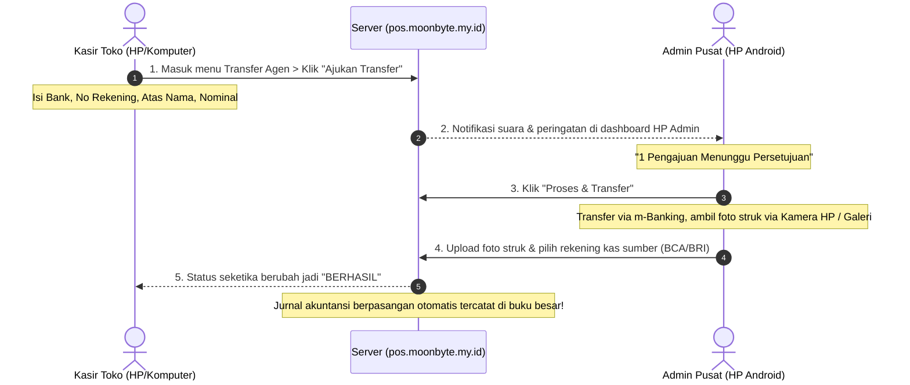

# Panduan Aplikasi Android (.APK), Akun Pengguna & Notifikasi Transfer Agen - ELEPHANT POS

Sistem telah berhasil dibangun menjadi aplikasi **Android Native `.APK`**, dilengkapi **Sistem Manajemen Akun & Hak Akses (RBAC)**, serta alur **Pengajuan & Persetujuan Transfer Agen Real-Time**.

---

## 1. File Installer Android `.APK` Siap Pasang

File installer fisik Android (`.apk`) telah berhasil dibuild dan ditandatangani (*v1, v2, v3 signed*) dengan dukungan perangkat keras ponsel:
- **Upload Bukti Transfer**: Mendukung akses langsung ke **Kamera HP** (ambil foto struk) dan **Galeri Foto**.
- **Izin Notifikasi HP**: Mendukung `POST_NOTIFICATIONS` Android 13+ untuk bunyi & banner notifikasi.
- **Download File Excel & Struk**: Terhubung ke Android `DownloadManager` langsung masuk ke folder `Download` HP.
- **Tombol Back HP**: Mulus bernavigasi mundur (*back history*) di dalam aplikasi tanpa keluar mendadak.

### Lokasi File APK & Link Download:
- **Di Komputer Anda**: `d:\laravel\rekap-penjualan\elephant-pos.apk`
- **Di Folder Publik Web**: `d:\laravel\rekap-penjualan\public\download\elephant-pos.apk`
- **Link Download Langsung (Bisa kirim ke staf/kasir lewat WhatsApp)**:
  👉 **`https://pos.moonbyte.my.id/download/elephant-pos.apk`**
- **Di Dalam Web/Aplikasi**: Klik menu **"Download Aplikasi"** di sidebar, lalu pilih **"Unduh File Installer (.APK)"**.

*(Catatan: Anda juga bisa menjalankan ulang `python build-apk.py` kapan saja di terminal jika ingin mengkompilasi APK baru secara otomatis).*

---

## 2. Akun Default & Pembagian Hak Akses (Role)

Semua akun default disiapkan dengan kata sandi: **`Imron@0458`**

| Role / Peran | Alamat Email | Kata Sandi | Deskripsi & Hak Akses |
| :--- | :--- | :--- | :--- |
| **Super Admin** | `superadmin@elephantcell.com` | `Imron@0458` | **Akses Penuh**. Mengelola semua fitur, kelola akun pengguna, akuntansi & COA, tutup buku, dan persetujuan transfer agen. |
| **Admin Operasional** | `admin@elephantcell.com` | `Imron@0458` | **Pusat Operasional**. Menyetujui pengajuan transfer toko, upload struk bukti transfer, stok persediaan, pembelian, dan laporan. |
| **Kasir Toko (Cabang)** | `toko@elephantcell.com` | `Imron@0458` | **Operasional Toko**. Kasir Retail, Grosir, Pulsa/PPOB, dan **Pengajuan Transfer Agen**. Terkunci dari pengaturan dan pembukuan tahunan. |

### Mengubah Hak Akses & Menambah Akun:
1. Login sebagai **Super Admin** atau **Admin**.
2. Buka menu **Pengaturan** > **Kelola Pengguna** (`/settings/users`).
3. Anda dapat:
   - Menambah pengguna baru dengan peran Super Admin / Admin / Toko.
   - Mengubah nama toko/cabang dan nomor WhatsApp kasir.
   - **Mencentang/menghapus modul akses** (Kasir, Transfer, Master Data, Pembelian, Akuntansi, Laporan, Pengaturan, Kelola User) secara fleksibel!
   - Mengaktifkan atau menonaktifkan akun.

---

## 3. Alur Kerja Transfer Agen (Toko & Admin)

---

## 4. Cara Pengujian & Uji Coba

1. **Uji Coba Login**:
   - Buka `https://pos.moonbyte.my.id/login` (atau `http://127.0.0.1:8000/login`).
   - Gunakan tombol cepat *Pilih Akun Demo* di bawah form login untuk berpindah antar **Super Admin**, **Admin**, dan **Toko**.
2. **Uji Coba Pengajuan Transfer**:
   - Login sebagai **`toko@elephantcell.com`**, buka menu **Transfer Agen**, ajukan transfer (misal Rp 100.000 ke BCA).
3. **Uji Coba Persetujuan & Upload Struk**:
   - Login sebagai **`admin@elephantcell.com`**, periksa antrean pending, klik **Proses & Transfer**, pilih rekening sumber, dan upload foto bukti struk.
   - Periksa bahwa status langsung menjadi **Berhasil** dan jurnal kas/bank tercatat otomatis.
